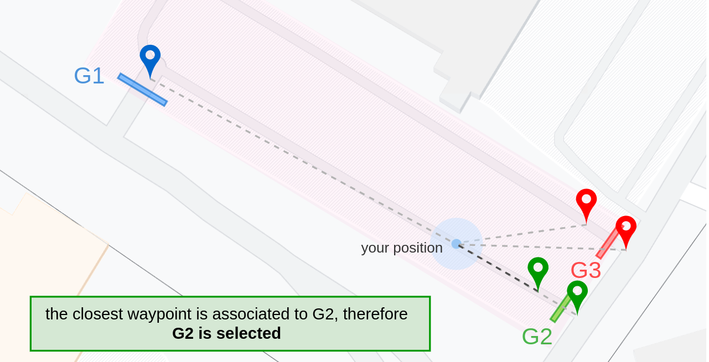

<h1 align="center">gpgate</h1>
<p align="center">aka <i>Global Positioning GATE</i> (remote controller)</p>

This sketch implements a gate remote control system based on GPS position. I coded this back in 2020 to fritter away time during a COVID lockdown, but I think it is an idea worthy to be published, even if the project is not completed.

**Current development status**: **BETA** - The sketch works fine under real-life tests. Need to test more outside Debug Mode to be sure that there are no nasty bugs so far. However, there is the need to implement some other functions before the final release (see *Development TODO* list).

<br>

## How it works

This sketch uses your GPS position to **select the right gate** among the available ones. The sketch provides a RGB LED to show which gate is selected, using the color associated by the user. Eventually, the sketch provides a button which triggers the RC module, sending the signal corresponding to the currently selected gate.

Let us suppose you have three gates, disposed as shown in this map.


This gate setup would be encoded in `mygates.h` as
```cpp
//  entry gate is { label, rc code, color }
const gate gates[] = {
                 { "g1", "001100010010", 0x0000FF }, 
                 { "g2", "011110100001", 0x00FF00 },
                 { "g3", "101101110011", 0xFF0000 }
               };
```

The first value is just a string used as identifier (for debug). The second value is the string of bits required by [rc-switch](https://github.com/sui77/rc-switch) to send the right RC signal. Look at this [example](https://github.com/sui77/rc-switch/tree/master/examples/ReceiveDemo_Advanced) of rc-switch to get the right string for your gate. The third value is the color associated to the gate, specified as hexadecimal value.

<br>

As for the **waypoints**, they are prompted too as an array of structured values. We are required to specify the latitude & longitude (first two double values). The third entry is (as unsigned int) the number of the gate, which is determined by the order specified in the array `gates[]` above). Finally, the fourth value is just a label for debug prints.

```cpp
//  entry waypoint is { latitude, longitude, id, label }
const waypoint wps[] = {
                 { 46.23212, 6.04516, 1, "gate1" },  // main entrance
                 { 46.23176, 6.04611, 2, "gate2" },  // exit
                 { 46.23187, 6.04627, 3, "gate3" }   // secondary entrance
                };
```


<br>

The gate is selected by looking at the distance from your position and all the waypoints. Then **the gate associated to the closest waypoint is selected**, provided that the GPS fix is stable. The following picture is a simple example of selection given the configuration specified above.


If you like, you can **associate more waypoints to each gate**. This might improve the selection accuracy in some particular circumstances, such as in the case of *close gates* (like G2 and G3 in this example).

The configuration would look like this:
```cpp
//  entry waypoint is { latitude, longitude, id, label }
const waypoint wps[] = {
                 { 46.23212, 6.04516, 1, "gate1" },  // main entrance
                 { 46.23175, 6.04617, 2, "gate2a" }, // exit
                 { 46.23173, 6.04622, 2, "gate2b" }, //   "  bis
                 { 46.23187, 6.04629, 3, "gate3a" }, // secondary entrance
                 { 46.23184, 6.04633, 3, "gate3b" }  //   "   "  bis
                };
```

<br>

Finally, the configuration file `mygates.h` has to be completed by configuring the **pulse length** of the signal and the **transmission protocol** (see rc-switch usage) ...
```cpp
#define RF_PULSELEN 420  // pulse length [ms]
#define RF_PROTOCOL  10  // trasmission protocol
```
... as well as the two size constants (required by my code)
```cpp
// sys variables (do NOT edit)
const size_t nwps = sizeof(wps)/sizeof(wps[0]);
const size_t ngates = sizeof(gates)/sizeof(gates[0]);
```


### How to find the coordinates and the rc codes?

The **GPS coordinates** for your waypoints can be found using Google Maps, or you can use you own Arduino GPS module to find them. In the latter case, I suggest you look at this [example](https://github.com/mikalhart/TinyGPSPlus/tree/master/examples/FullExample) in the TinyGPS++ library. Don't use many digits in the coordinates: six will be fine!

As for the radio codes, **the documentation of rc-switch is the best way to start using radio controlled devices**. I suggest to use a receiver module and this [sketch](https://github.com/sui77/rc-switch/tree/master/examples/ReceiveDemo_Advanced) to decode the RC code of your gates & find the right transmission protocol.


### How to open the gate?

The LED color will inform you of the currently selected gate. Use a short keypress on the button to send the signal to the selected gate.

**Why not automatically send the signal when you are really close to the gate?** For security reasons! Being close to a gate doesn't mean that I want to activate it, expecially if there are other people moving around it. It is *your responsibility* to press the button and activate the gate. :)


### Operation status

Hopefully, the GPS signal will be accurate most of the time - aka, the GPS is **fixed**. However, there there might be circumstances in which the GPS is **unfixed**. In this scenario, gpgate will keep the last gate selection (the first gate, if the system has just booted).

There is a way to still use gpgate without the GPS fix: the **manual mode**. This mode will allow you to **choose a gate and keep it selected for 30 seconds**. After the time expires, gpgate will automatically revert to GPS fixed/unfixed mode. 

You can enter manual mode by **keeping keypressed the button for 1 second**. Every long press of 1 second in manual mode will select the next gate (in the order of declaration). You should see the LED color change according to your selection. As usual, a short pressure of the button will send the RC signal to the manually selected gate. 

<br>

## Setup

You have to create your own `mygate.h` file, which will provide your waypoints and gates to the sketch. Take a look at the template file `mygate_demo.h` and at the previous section for more details.

The file `general.h` will include the **hardware configuration** of you Arduino sketch, i.e. the pin configuration. My one, on an Arduino Nano, is the following:
```cpp
...

// ---------------
//   INTERFACE
// ---------------
#define USB_BAUD 115200  // USB baud rate (DEBUG only)
#define GPSBAUD    9600  // GPS module baud rate

#define PIN_BMAIN   A5   //control button pin
#define PIN_GPS_TX   2   //GPS tx-pin
#define PIN_GPS_RX   3   //GPS rx-pin
#define PIN_LED     A2   //LED clock contrl pin
#define PIN_RF      A4   //trasmitter pin

...
```
This file will also set all the properties and configuration of the gpgate logic itself. Trust the comments to understand and tweak them, if you need to.


Finally, we **require the following Arduino libraries** to compile the sketch:
- rc-switch ([git](https://github.com/sui77/rc-switch))
- TinyGPS++ ([git](https://github.com/mikalhart/TinyGPSPlus/))
- FastLED ([git](https://github.com/FastLED/FastLED)) (if you use my animations module)
- SoftwareSerial ([built-in](https://docs.arduino.cc/learn/built-in-libraries/software-serial))

You notice that there are many C++ files in the sketch folder, but the main one of course has the *.ino* extension: `gpgate.ino`. Open it with Arduino IDE, compile & upload to your Arduino device when everything is configured.

### Adapt the software to your hardware

Even though the logic of gate selection is very generic, the hardware you use is not. This is why I did not code everything in the main *.ino* file, trying to be more modular. In particular, I would like to show you **the interface of the LED module**.

**Why the LED module, in particular?** Well, simply, your LED setup is the hardware that I expect to vary the most and I would like to show you what to implement, if you need you own customization.

gpgate allows you to animate a LED strip to indicate the system status (GPS fixed, unfixed or manual mode). In my case, I had a 7 RGB LED ring, animated using [FastLED](https://github.com/FastLED/FastLED) library. If you don't want to use my animated module, you can create your own! You can keep the header file `led.h`, of course, but you must change the implementation in `led.cpp`.

<br>

The minimal LED interface is given by the following functions:

| Declaration     | Description |
| ----------- | ----------- |
| `void init_led()` | A function which initializes the LED, to be called in `setup()`.      |
| `void led_set_color(color_t color)`   | A function which changes the current LED color. The color is specified as hex values. |

If the flag `USE_LED_ANIMATION` is defined in `general.h`, the Arduino sketch will operate the LED by calling a periodic update function to refresh the animation. In this case, it is necessary to provide two more functions:

| Declaration (**only if LEDs are animated**) | Description |
| ----------- | ----------- |
| `void led_update()` |  A function which is periodically called (at freqency `LED_FPS`, set in `general.h`) to update the LED. |
| `void led_set_animation()` | A function which selects the current animation. I suggest to use a (private) function pointer to select the right one. |

Other properties like the `LED_TYPE` and `LED_NUMBER` can be defined in `led.cpp`, because they are not required to be available externally.

## Develoment: TODO list

**High priority**
- use HDOP as a criteria for GPS fix control
- implement a suspension/wake-up system to save energy

**Really extra**
- solder the circuit on PCB and build a 3D printable case
